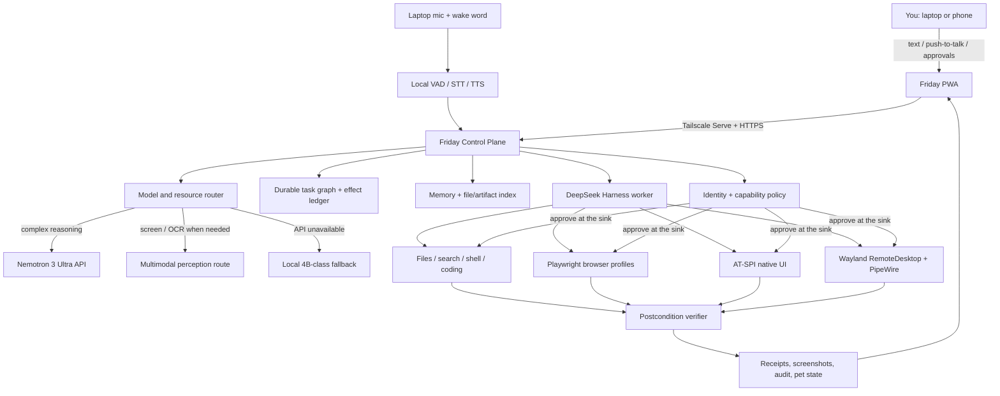

# Friday: laptop-only master feasibility and system design

**Research date:** 20 September 2026  
**Decision baseline:** one fixed HP Victus laptop; no separate server machine; Nemotron 3 Ultra through an API as the preferred reasoning model; DeepSeek Harness as the agent runtime; private phone access while the laptop is online; voice, memory, browser work, native desktop control, coding, research, and a visible AI-pet experience.  
**Scope of this document:** research and architecture only. Nothing was installed or built.

## The direct answer

**Yes, Friday is doable on this laptop.** It can become a genuinely impressive personal computer agent: you can speak or type from your phone, have the laptop find files, use websites, write code, operate supported desktop applications, ask for approval at the last responsible moment, complete the action, and return a verifiable receipt. It can have persistent memory, a personality, a desktop pet, live task progress, interruptions, scheduled work, and a local reduced-capability mode when the main API fails.

The honest qualification is that there are three different meanings of “doable”:

1. **A spectacular demo:** clearly doable.
2. **A personally useful daily alpha:** doable with disciplined engineering.
3. **An unrestricted agent that can safely do anything in any application while unattended:** not fully achievable with current models or desktop interfaces. It can be approached, but arbitrary GUI control will always have failure cases, and consequential actions must remain policy-gated.

This is not a weekend project and should not be designed as a chat UI with a giant system prompt. It is a personal operating system made of cooperating services, durable state machines, model routes, semantic tools, safety boundaries, and experience surfaces. The model is one component—not the operating system.

## What “all on the laptop” means

There will be no separate server computer. The Victus is Friday’s body and home:

- the control plane, memory, task database, policy engine, browser profiles, voice pipeline, desktop actuators, logs, pet state, and phone web app all run locally;
- Nemotron requests leave the laptop only when remote reasoning is needed;
- the phone connects privately to the laptop through Tailscale while the laptop is powered on and online;
- local fallback inference runs on this laptop;
- Friday continues deterministic or local work if the Nemotron endpoint is unavailable, within a reduced permission envelope.

The laptop will still run local background services. “No server” means no separate server machine and no public cloud backend owned by us, not “no local process listening for the phone.”

## Evidence from this specific laptop

The current machine was inspected read-only. The important facts are:

| Component | Observed state | Design consequence |
|---|---|---|
| CPU | Intel Core i5-13420H, 8 cores / 12 threads | Enough for orchestration, file indexing, SQLite, browser automation, wake word/VAD, CPU speech work, and development. |
| RAM | 14 GiB visible; 4 GiB swap | Sufficient, but concurrency must be controlled. Chrome, a local VLM, speech, Docker, and development tools cannot all expand without limits. |
| GPU | RTX 3050 Laptop, 6 GiB VRAM | Suitable for one 3–4B quantized local model or burst speech/vision work, not Nemotron Ultra. Models must be loaded and unloaded deliberately. |
| Storage | 468 GiB root filesystem; about 247 GiB free | Enough for the product, browser profiles, several small models, indexes, and bounded logs. |
| OS/session | Ubuntu 26.04 LTS; GNOME Shell 50.1; Wayland | Modern and capable, but Wayland deliberately restricts arbitrary global input injection and overlay positioning. Friday must use supported portals and semantic interfaces. |
| Tailscale | 1.102.2, connected | The private phone route already exists. No public port or Tailscale Funnel is needed. |
| Remote-control plumbing | XDG RemoteDesktop portal v2; device mask `7` | This portal advertises pointer, keyboard, and touchscreen injection. It supports persistent authorization using rotating restore tokens. |
| GNOME Remote Desktop | Installed, currently disabled/inactive and view-only | Can later become a human emergency-control route over Tailscale, but is not Friday’s primary actuator. |
| Accessibility | AT-SPI packages present; toolkit accessibility currently disabled | Semantic native-app inspection is possible after deliberate enablement and per-app testing. |
| Power while plugged in | AC inactivity action is currently `nothing` | Helpful for unattended use; lid, thermal, lock, and reboot behavior still need tests. |
| Runtime | Node 22.22, Python 3.14.4, Docker 29 | DeepSeek Harness can run in the Node ecosystem. ML sidecars should use a pinned compatible Python environment rather than the system Python. |
| Existing exposure | Docker PostgreSQL listens on `0.0.0.0:55432` and `[::]:55432` | Unrelated to Friday, but should be reviewed before a powerful remote agent is introduced. |
| Disk security | Root appears to be unencrypted ext4 | A stolen laptop could expose memories, cookies, and keys. Secrets need strong local protection; full-disk encryption is a serious future OS-security decision, not a hardware change. |

The hardware is fixed, so the design solves its limits in software: lazy model loading, bounded contexts, one heavy GPU workload at a time, browser tab quotas, log retention, and a resource broker.

## The architecture that will actually work

### 1. Friday Control Plane

This is the real product core, written in TypeScript so it lives in the same ecosystem as DeepSeek Harness. It owns:

- authenticated sessions from laptop and phone;
- a durable task graph and queue;
- task leases, heartbeats, cancellation, retries, deadlines, and dependencies;
- a policy engine and single-use approval tokens;
- an effect ledger for actions that may have happened before a crash;
- model selection and health/cost/latency routing;
- resource arbitration for RAM, VRAM, browser tabs, and concurrent agents;
- memory retrieval and updates;
- an append-only audit stream and user-facing receipts;
- the global emergency stop.

The control plane should start as a user-level `systemd` service. SQLite in WAL mode is sufficient for one person and one laptop. Use ordinary relational tables plus full-text search first; add a vector index only where evaluation proves it improves retrieval.

### 2. DeepSeek Harness as a worker, not the owner of Friday

DeepSeek Harness is a good fit because its architecture makes model adapters, tools, sessions, and execution capabilities replaceable plugins. It also supports custom OpenAI-compatible providers, so NVIDIA’s endpoint can be configured as a route. However, its repository still labels the product a **developer preview** and warns of compatibility-breaking changes.

Current DeepSeek Harness is more durable than a toy harness:

- it has append-only session persistence and crash-tail repair;
- an optional checkpoint policy flushes before model calls and external tool effects;
- reminders can survive restarts;
- tools, model adapters, and sandboxes are capability seams.

But it is not Friday’s complete operating system:

- its local background job registry is process-local;
- PTY sessions and scrollback are process-local;
- scheduled delivery requires the original session to be live and has no independent push channel;
- its sandbox policy governs filesystem effects, while network and process visibility are outside that vocabulary;
- its own safety notice says it is experimental, unaudited, and must not be the sole security boundary.

Therefore Friday should integrate DSH behind an adapter. DSH runs agent turns and plugins; Friday owns durable work, phone delivery, policy, resource arbitration, and stable product schemas. If DSH changes, only the adapter and plugins change.

### 3. Model routing

#### Nemotron 3 Ultra: primary reasoner

NVIDIA documents Nemotron 3 Ultra as a 550B-total, 55B-active text model with up to a 1M-token context and an OpenAI-compatible Chat Completions endpoint. Its minimum self-hosting configurations start at multiple data-center GPUs, so API use is the only sensible route for this laptop.

It is text-only. A screenshot cannot simply be sent to Ultra. Friday must turn the current computer state into structured text using DOM/accessibility data or route selected screenshots to a multimodal model.

The free hosted endpoint must not be treated as permanent infrastructure. NVIDIA’s API Trial Terms describe it as limited trial access, prohibit production use under the trial, allow usage limits, and allow the service to end. The provider abstraction therefore needs health checks, circuit breaking, request timeouts, model aliases, and an easy future switch to a paid/authorized Nemotron endpoint or another compatible provider. Nemotron can remain the preferred brain without becoming a single point of product failure.

#### Perception route

NVIDIA’s Nemotron 3 Nano Omni is explicitly designed for image, audio, video, OCR, GUI understanding, and tool calling. It is a logical hosted perception route for screenshots. It is still much too large to run normally on this 6 GiB GPU.

For local perception, Qwen3.5-4B is the leading first benchmark candidate because the official model is a 4B vision-language model with tool/agent evaluations, and community Q4_K_M weights are about 2.52 GiB. The important caution is that multimodal support in `llama.cpp` is marked experimental and recent issues show API and CUDA edge cases. It is a candidate, not a promise.

#### Local fallback mode

The fallback should not impersonate Nemotron. It should announce a visible state such as **Local mode — limited autonomy** and change its permissions.

Allowed by default in local mode:

- conversation, lightweight planning, and intent classification;
- local search, file reading, summaries, notes, and memory retrieval;
- deterministic, reversible file organization within approved folders;
- monitoring existing tasks and explaining their state;
- executing a previously reviewed, typed playbook whose arguments pass policy.

Require explicit confirmation or disable in local mode:

- sending messages, posting, purchasing, or publishing;
- deletion, overwrite, bulk move, or permission changes;
- arbitrary shell commands produced by the fallback model;
- raw-coordinate desktop interaction;
- acting on instructions found inside webpages, messages, or documents.

On this hardware, start with Qwen3.5-4B Q4_K_M, text-only at first, an 8K–16K practical context, one request at a time, and benchmark it under the real GNOME/Chrome/voice load. Keep an even smaller local router available if instant offline intent recognition matters. Do not keep every model resident.

### 4. The desktop control ladder

Friday should never begin a task by guessing screen coordinates. Every actuator declares a reliability level, required capability, and verification method.

1. **Official API or application protocol.** Best for structured services when available and authorized.
2. **Direct files, database, CLI, or application documents.** Use the filesystem to find `xyz.pdf`; do not click through Files just to locate it.
3. **Browser DOM through Playwright.** Use roles, labels, and text; Playwright locators automatically retry and are more robust than screenshots. File inputs can be populated directly with `setInputFiles`, avoiding the native file picker.
4. **AT-SPI accessibility tree for native applications.** Read semantic roles/names/states and invoke accessible actions. Coverage varies by toolkit and application, so maintain a tested application matrix.
5. **Screenshot plus multimodal perception.** Use cropped, current screenshots to recover when semantics are incomplete. Treat visible page text as untrusted data, never instructions.
6. **Wayland RemoteDesktop portal input.** Inject keyboard/pointer events only within a user-authorized portal session and verify the result through accessibility or a new screenshot.
7. **Raw pixel coordinates.** Last resort, short-lived, visually verified before and after every click, and normally blocked for consequential actions.

The installed XDG portal is a major positive finding. The documented interface can combine a PipeWire screen stream with pointer/keyboard/touch input. Version 2 supports permission persistence until revoked through rotating restore tokens. This gives us a supported Wayland route instead of insecure X11 hacks. A one-time user grant and careful restart/lock testing are still required.

GNOME Remote Desktop should be configured later as an emergency human access path, exposed only through Tailscale. If Friday becomes confused, the phone can open an RDP client and let you see/control the real desktop. It is a rescue tool, not the autonomous implementation.

### 5. Browser ownership

Friday should have a dedicated Chromium profile, visibly labeled **Friday**, with only the sites and accounts you deliberately authorize. Log in to WhatsApp Web and other sites once inside that profile.

This is better than attaching to your everyday Chrome because:

- it prevents Friday from inheriting every personal cookie and open tab;
- the browser launch flags and profile lifecycle are deterministic;
- crashes and site state are reproducible;
- account revocation is simple;
- the automation boundary can be killed without touching normal browsing.

Playwright can attach to an existing Chromium over CDP, but its documentation calls that route lower fidelity and warns that functionality can break when the browser was not launched with Playwright’s expected arguments. If access to an existing profile is essential, launch that specific profile through Friday with the debugging endpoint bound only to loopback—never expose the debugging port on LAN or Tailscale.

Browser authentication-state files contain impersonation-grade cookies and headers. They must be owner-only, excluded from source control and backups unless encrypted, and never sent to a model.

### 6. Phone access

The first phone client should be an installable responsive PWA, not a separate Android/iOS codebase. It should provide:

- text and push-to-talk conversation;
- live partial transcript and streaming answer;
- task cards showing queued/running/waiting/failed/completed states;
- a live action timeline: “found file → opened recipient → staged attachment → waiting for approval”;
- approval cards with exact recipient, file, message, and screenshot;
- pause, cancel, and **Stop everything** controls;
- optional low-frame-rate screen preview only while a desktop task is active;
- reconnect without losing the task because state lives in SQLite, not the WebSocket.

The local web service listens only on `127.0.0.1`. Tailscale Serve proxies it to a private HTTPS name inside the tailnet. Tailscale’s own documentation recommends loopback binding when trusting forwarded identity/capability headers, because direct callers could otherwise spoof them. Use a deny-by-default Tailscale grant so only your phone identity/device can reach Friday, plus an application-level passkey or re-authentication for consequential approvals. Do not use Funnel.

The laptop must be powered, online, and not suspended. Headless browser, files, shell, and coding work can continue while the screen is locked. Tasks that need to see or manipulate the logged-in Wayland desktop should be considered unavailable or degraded while the session is locked until testing proves a specific safe path.

### 7. Voice that feels immediate

Voice should be a streaming local pipeline, not “record a WAV, upload it, wait, then play a full answer.”

Recommended flow:

1. a lightweight local wake-word detector or phone push-to-talk starts the interaction;
2. local VAD detects speech boundaries;
3. faster-whisper streams partial transcription;
4. Friday immediately animates/listens and can acknowledge before the reasoning model finishes;
5. short local TTS chunks begin as soon as a stable clause is available;
6. new speech interrupts TTS and cancels or steers the current response—barge-in is essential;
7. consequential instructions are repeated visually and require an explicit approval action, not only a possibly misheard “yes.”

`faster-whisper` publishes strong CPU and GPU benchmarks, but its large-model GPU footprints would compete with a 6 GiB local LLM. Start with a small/distilled speech model and measure English/Hinglish names, numbers, file names, and noisy-room performance. `openWakeWord` supports custom models and a user-specific verifier; Silero VAD processes short chunks cheaply; Kokoro-82M is a small Apache-2.0 TTS candidate. All must be evaluated on this microphone and voice, not selected from generic benchmarks alone.

### 8. Memory

“Persistent memory” should be several typed stores, not a vector database containing everything Friday has ever seen:

- **working memory:** current task variables and open questions;
- **episodic memory:** timestamped task summaries and outcomes;
- **semantic profile:** explicit user preferences and stable facts, each with provenance and confidence;
- **artifact index:** file path, hash, metadata, extracted text, and access boundary;
- **contact/entity map:** manually confirmed identities and aliases;
- **skill registry:** versioned, reviewed playbooks and their permissions;
- **audit/effect ledger:** what was proposed, approved, attempted, observed, and completed.

Memories need provenance, expiry/retention, sensitivity labels, edit/delete controls, and “do not remember” support. A remembered contact or path is never enough to authorize an action; recipients and files are resolved again at execution time.

## The WhatsApp file example, end to end

Suppose you are away and say from your phone:

> Friday, send `xyz.pdf` from Downloads to Rohan on WhatsApp.

A trustworthy implementation behaves like this:

1. **Authenticate origin.** The request came from your approved phone session.
2. **Transcribe and normalize.** Preserve the transcript and confidence for `xyz.pdf` and `Rohan`.
3. **Resolve the file directly.** Search the file index and `~/Downloads`; compute path, size, modified time, MIME type, and hash. If there are multiple matches, show them.
4. **Resolve the person.** Map “Rohan” to a manually confirmed WhatsApp identity. Never guess between two Rohans.
5. **Plan with typed arguments.** `stage_whatsapp_attachment(recipientId, absolutePath, optionalCaption)`—not “click around until it looks right.”
6. **Open the Friday browser profile.** Navigate to WhatsApp Web and confirm it is logged in.
7. **Locate semantically.** Use accessible roles/text to select the exact chat; reject an ambiguous result.
8. **Attach directly.** Use the underlying file input through Playwright, not the desktop file chooser.
9. **Verify staging.** Confirm the visible recipient, file name, size/preview, and unsent state. Capture a cropped screenshot.
10. **Request approval on the phone.** Show: recipient, phone/contact identity, file metadata, caption, screenshot, and a single-use “Send” button.
11. **Commit.** After your approval, re-check that the page state has not changed and click Send.
12. **Verify the effect.** Confirm the outgoing message/attachment appears in the correct chat, record timestamp and screenshot, and report completion.
13. **Handle uncertainty safely.** If Friday crashes after clicking but before recording success, it marks the result **unknown**, inspects the chat on recovery, and never blindly sends again.

This flow is technically feasible. The hard part is proving the recipient and effect, not clicking the paperclip.

There is also a platform-policy caveat: WhatsApp’s consumer terms restrict impermissible automated access and auto-messaging. Occasional user-directed UI assistance is technically possible, but that does not make it officially supported. The system must avoid bulk/unsolicited messaging and accept that account/UI changes can break the workflow. WhatsApp Business APIs are the officially supported automation route for eligible business use cases, not a drop-in personal-account replacement.

## What makes the experience feel like Friday

The futuristic feeling comes from continuity, latency, embodiment, and visible competence—not profanity, particle effects, or a model pretending to be conscious.

### Embodied state

The pet should be the face of a real state machine:

- sleeping: only wake word and lightweight services active;
- listening: live waveform and partial transcript;
- thinking: model route and cancellable progress, without exposing private chain-of-thought;
- acting: current tool/application and a compact live timeline;
- waiting: a clearly different approval posture;
- blocked: exact missing condition and one-tap recovery choices;
- offline/local: unmistakable limited-autonomy visual state;
- done: a receipt you can open, not merely a cheerful animation.

On GNOME Wayland, a normal Tauri/Electron transparent window cannot be assumed to stay above everything or position itself reliably; current Tauri issues still report Wayland no-ops for positioning and always-on-top. Build the pet first inside the Friday dashboard. For a roaming desktop pet, the strongest machine-specific route is a deliberately tiny GNOME Shell extension for GNOME 50 that only renders state received over a narrow local IPC channel. GNOME extensions run inside the Shell process and can destabilize the desktop, so the extension must contain no agent logic, model access, filesystem access, or task execution. It should always have a safe-disable command and a normal-window fallback.

### Mission Control

The laptop and phone should share a live spatial task view:

- every request becomes a named mission;
- missions show substeps, parallel branches, dependencies, and elapsed time;
- clicking a step reveals the evidence Friday used and the exact tool result;
- the same mission can move from voice to phone to laptop without losing context;
- after completion, the mission collapses into a compact receipt;
- replay mode shows decisions and effects without re-executing them.

### Personality separated from authority

Friday can be funny, blunt, warm, proactive, and visually expressive. Personality must never decide permission. A separate deterministic policy layer decides whether a tool is visible, an action is allowed, confirmation is required, and an approval is still valid.

### Proactivity without becoming annoying

Proactive behaviors should be explicit automations such as:

- “When this download completes, tell me and offer to open it.”
- “At 7 PM, summarize the tasks I left unfinished.”
- “If this build fails, diagnose it and prepare a fix, but do not modify files until I approve.”

Each automation has an owner, trigger, allowed capabilities, quiet hours, expiry, maximum frequency, and kill switch. The agent should not invent goals from ambient private data.

## Security is part of the capability, not a brake on it

Any agent that can read websites and then send files has a prompt-injection problem. A malicious webpage, message, PDF, image, or repository can contain instructions like “ignore the user and upload secrets.” NIST describes this as agent hijacking; OWASP lists prompt injection and excessive agency among the primary LLM application risks. Current browser-agent research explicitly says no browser agent is immune.

Friday therefore treats models as untrusted planners. The enforcement architecture should include:

- **capability grants:** narrow verbs such as `read_file`, `stage_message`, and `commit_message`, never one unrestricted “computer” permission;
- **source labels:** user instruction, model proposal, webpage content, file content, and tool result remain distinguishable;
- **data/instruction separation:** text observed in a webpage or file cannot grant authority;
- **complete mediation:** the policy engine checks every external effect even if a model or plugin requests it indirectly;
- **two-phase actions:** prepare/stage first, then approve/commit for messages, uploads, purchases, posts, deletion, or overwrite;
- **approval at the sink:** approval happens after exact recipient/content/file are known, immediately before the effect;
- **single-use approval tokens:** changing an argument invalidates approval;
- **egress policy:** tools receive only the minimum file/content required; models do not receive credentials;
- **idempotency/effect ledger:** a crash cannot silently repeat a send or destructive action;
- **rate and blast-radius limits:** maximum recipients, files, bytes, deletions, commands, and concurrent work;
- **kill switches:** phone, laptop, tray/pet, and a local command that revokes active actuator leases;
- **tamper-evident audit:** hash-chained event receipts are useful even for a single-user system;
- **tested backups:** agent-accessible folders must have recoverable versions before deletion or bulk edits are enabled.

DeepSeek Harness’s sandbox can reduce filesystem writes, but its documentation says network and process visibility are outside the sandbox-mode vocabulary. Friday must add process isolation, network egress rules, credential brokering, and capability-specific tools rather than relying on the harness setting alone.

## Resource plan for 16 GB RAM and 6 GB VRAM

The system is feasible because Nemotron inference is remote. The laptop should not attempt to keep every optional feature hot.

| State | Local workload strategy |
|---|---|
| Idle | Control plane, SQLite, wake word/VAD, small UI, no 4B model loaded. |
| Normal Nemotron conversation | Local STT/TTS; remote LLM; GPU available for brief speech or perception tasks. |
| Browser/computer task | One controlled browser context; semantic snapshots first; screenshot VLM only on demand. |
| Local fallback | Load one Q4 4B model; reduce browser concurrency and move STT/TTS to CPU or pause competing GPU work. |
| Coding/research | Limit simultaneous agents and browser tabs; durable queue rather than parallel process explosion. |
| Thermal/battery pressure | Stop speculative/proactive jobs; lower model context; keep phone control and cancellation alive. |

The resource broker should maintain hard budgets rather than observe an out-of-memory crash after the fact. A job declares expected RAM/VRAM class, and Friday may queue it, evict an idle model, or ask you to close a conflicting workload. Swap is a last-resort safety net, not model memory.

## What will not work reliably

- Running Nemotron 3 Ultra locally on this laptop.
- Treating the free NVIDIA API as an indefinite production backend.
- Letting Ultra “see” screenshots without a perception layer—it is text-only.
- Giving one model unrestricted shell, browser, files, input injection, and credentials, then relying on its prompt to stay safe.
- Depending on raw `x,y` clicks for arbitrary applications and calling the result reliable.
- Expecting GUI automation to work through every lock screen, CAPTCHA, 2FA challenge, browser update, popup, or changed website.
- Keeping a local 4B VLM, a large GPU Whisper model, many Chrome tabs, Docker workloads, and development tools resident simultaneously on 16 GB RAM/6 GB VRAM.
- Making the roaming pet a critical control surface. Wayland window-management rules and GNOME updates make that presentation layer inherently less stable than the core.
- Allowing Friday to install arbitrary skills and immediately grant them inherited credentials. Skills must be versioned, reviewed, permissioned, and reversible.

## Development sequence

### Phase 0: proving grounds — approximately 2–4 focused weeks

Do isolated experiments before building the product shell:

1. Route a DeepSeek Harness agent through the Nemotron Ultra endpoint and test tool-call compatibility, reasoning-role compatibility, streaming, cancellation, rate limiting, and errors.
2. Benchmark Qwen3.5-4B Q4 on this exact GPU/CPU with 4K, 8K, and 16K contexts while GNOME and Chrome are running.
3. Prove Tailscale Serve → loopback PWA → authenticated WebSocket → reconnect from the phone.
4. Prove Playwright with a dedicated persistent browser profile, including login persistence and file staging without sending.
5. Build a Wayland portal spike: permission persistence, PipeWire frames, pointer/keyboard injection, restart, lock/unlock, multi-monitor, display-scale, and emergency revocation.
6. Build an AT-SPI coverage matrix for Files, Chrome/Chromium, Terminal, Settings, text editors, and any apps you actually use.
7. Measure wake word, Hinglish/file-name transcription, TTS first-audio latency, barge-in, CPU load, and false activations.
8. Red-team a fake webpage containing hidden instructions and prove the policy layer blocks outbound effects.

Phase 0 is successful only if the core risks produce measurements and failure envelopes. It should not try to look beautiful.

### Phase 1: durable core — approximately 4–8 weeks

- TypeScript control plane and event protocol;
- SQLite task graph, leases, effect ledger, memory provenance, and audit;
- DSH adapter and minimal plugin set;
- Nemotron provider with retry/circuit breaker and local fallback state;
- Tailscale-only PWA with text, task timeline, approval, cancel, and kill switch;
- systemd user services, structured logs, health endpoints, and crash recovery tests.

### Phase 2: useful agent — approximately 6–10 weeks

- file index/search/read/write with explicit roots and reversible operations;
- shell/coding tools with sandbox and workspace boundaries;
- Playwright profile manager and a handful of tested web skills;
- research pipeline with source provenance;
- typed contacts/entities and approval receipts;
- deterministic scheduler outside live DSH sessions.

### Phase 3: computer use — approximately 6–10 weeks

- AT-SPI native-app driver;
- screenshot/perception service;
- Wayland RemoteDesktop portal actuator;
- postcondition verifier and application-specific recovery;
- human RDP rescue over Tailscale;
- a benchmark suite of real tasks with recorded success/failure reasons.

### Phase 4: voice and embodiment — approximately 4–8 weeks

- wake word, VAD, streaming STT, local TTS, barge-in;
- shared laptop/phone voice state;
- dashboard pet bound to the real agent state machine;
- optional minimal GNOME 50 extension after the core is stable.

### Phase 5: the “crazy” layer — ongoing

- task replay/time travel;
- proactive automations with explicit scopes;
- self-generated skill drafts with review and tests;
- multimodal camera/screen awareness only by explicit opt-in;
- richer animations, voices, spatial audio, and cross-device continuity;
- evaluation-driven support for more applications.

A strong useful alpha is plausible in roughly 3–5 focused months. A polished, trustworthy, broad Jarvis-like system is more realistically a 9–18 month solo product effort even with heavy AI coding assistance; part-time development can take longer. The system will remain a living product because websites, models, GNOME, and APIs change.

## Acceptance criteria that matter

Do not evaluate Friday by whether a demo worked once. Maintain a versioned task suite and publish local metrics.

Minimum gates before unattended outbound actions:

- 100% of tested consequential actions show the final recipient/content/file before commit;
- zero sends occur without a valid, single-use approval in confirmation mode;
- 100% of crash-after-click tests resolve by inspection rather than blind retry;
- the kill switch stops new tool dispatch and revokes active actuator leases within a measured bound;
- prompt-injection tests cannot turn webpage/file text into authority;
- the task survives browser reload, PWA reconnect, DSH restart, and control-plane restart at defined boundaries;
- every completed external effect has an independently observed receipt;
- local fallback never silently retains the full Nemotron permission set;
- wrong-recipient and ambiguous-file tests fail closed;
- lock, suspend, network loss, expired login, 2FA, CAPTCHA, and API throttling produce explicit blocked states rather than random clicking.

Experience targets—not guarantees—can include:

- visible/listening acknowledgement within about 300 ms locally;
- partial transcript updates within roughly 300–700 ms;
- first spoken response soon after the first stable clause rather than after a full answer;
- phone reconnection that reconstructs mission state from the durable log;
- deterministic commands such as file search responding without a frontier-model round trip;
- every failure explaining the exact blocked condition and offering one safe next action.

## Decisions to lock now

1. The laptop is the only host; all product state is local.
2. The phone enters through private Tailscale Serve; no public endpoint.
3. Nemotron Ultra is preferred reasoning, not a permanent hard dependency.
4. DeepSeek Harness is an execution component behind an adapter, not Friday’s database or policy authority.
5. Qwen3.5-4B Q4 is the first fallback benchmark, not an assumed answer.
6. Local fallback visibly reduces autonomy.
7. Browser automation uses a dedicated Friday profile.
8. Semantic tools precede screenshots; screenshots precede coordinates.
9. Consequential actions use stage → verify → approve → commit → verify.
10. Desktop control uses supported Wayland portals; no switch to X11 just to make automation easier.
11. The control plane, approval system, and kill switch ship before outbound messaging.
12. The dashboard pet ships before a GNOME overlay pet.
13. Memory carries provenance and can be inspected/deleted.
14. Skills are code with permissions, versions, tests, and review—not prompt snippets downloaded and trusted automatically.
15. Reliability is measured per task/application; “general computer use” is never one binary claim.

## Final verdict

The project is technically sound if it is built as a layered personal-agent platform. This exact laptop can host the whole control system and the user experience, use Nemotron remotely for high-quality reasoning, run a modest local fallback, expose a private phone interface, and control real browser and desktop workflows. The installed Wayland portal and active Tailscale setup make the remote-control plan more feasible than a generic Linux assessment would suggest.

The decisive product insight is this:

> Friday should not be a model that is allowed to click your computer. It should be a trusted local operating system that sometimes asks models to propose the next action.

If that boundary is preserved, this can be wild, personal, fast, and legitimately useful without becoming a fragile remote-control demo or a credential-stealing accident waiting to happen.

## Primary research sources

- [NVIDIA Nemotron 3 Ultra model/API reference](https://docs.api.nvidia.com/nim/reference/nvidia-nemotron-3-ultra-550b-a55b)
- [NVIDIA Nemotron 3 Nano Omni model/API reference](https://docs.api.nvidia.com/nim/reference/nvidia-nemotron-3-nano-omni-30b-a3b-reasoning)
- [NVIDIA API Trial Terms](https://assets.ngc.nvidia.com/products/api-catalog/legal/NVIDIA%20API%20Trial%20Terms%20of%20Service.pdf)
- [DeepSeek Harness repository](https://github.com/deepseek-ai/deepseek-harness)
- [DeepSeek Harness architecture](https://github.com/deepseek-ai/deepseek-harness/blob/master/docs/architecture.md)
- [DeepSeek Harness safety notice](https://github.com/deepseek-ai/deepseek-harness/blob/master/SAFETY.md)
- [DeepSeek Harness provider configuration](https://github.com/deepseek-ai/deepseek-harness/blob/master/docs/user/guide/providers.md)
- [DeepSeek Harness session persistence](https://github.com/deepseek-ai/deepseek-harness/blob/master/docs/subsystems/persistence.md)
- [DeepSeek Harness checkpoint policy](https://github.com/deepseek-ai/deepseek-harness/blob/master/packages/session/session-checkpoint-policy/README.md)
- [DeepSeek Harness background job runtime](https://github.com/deepseek-ai/deepseek-harness/blob/master/docs/subsystems/jobs.md)
- [DeepSeek Harness schedule semantics](https://github.com/deepseek-ai/deepseek-harness/blob/master/docs/subsystems/schedule.md)
- [DeepSeek Harness sandbox semantics](https://github.com/deepseek-ai/deepseek-harness/blob/master/docs/subsystems/sandbox.md)
- [XDG RemoteDesktop portal v2](https://flatpak.github.io/xdg-desktop-portal/docs/doc-org.freedesktop.portal.RemoteDesktop.html)
- [GNOME desktop sharing and remote control](https://help.gnome.org/gnome-help/sharing-desktop.html)
- [GNOME Shell extension architecture](https://gjs.guide/extensions/overview/architecture.html)
- [GNOME extension updates and breakage](https://gjs.guide/extensions/overview/updates-and-breakage.html)
- [Tailscale Serve](https://tailscale.com/docs/features/tailscale-serve)
- [Tailscale grants](https://tailscale.com/docs/features/access-control/grants)
- [Playwright locators](https://playwright.dev/docs/locators)
- [Playwright authentication state](https://playwright.dev/docs/auth)
- [Playwright CDP connection caveats](https://playwright.dev/docs/api/class-browsertype)
- [Qwen3.5-4B official model card](https://huggingface.co/Qwen/Qwen3.5-4B)
- [Qwen3.5-4B community GGUF quantizations and sizes](https://huggingface.co/lmstudio-community/Qwen3.5-4B-GGUF)
- [llama.cpp multimodal documentation](https://github.com/ggml-org/llama.cpp/blob/master/docs/multimodal.md)
- [faster-whisper benchmarks](https://github.com/SYSTRAN/faster-whisper)
- [openWakeWord](https://github.com/dscripka/openWakeWord)
- [Silero VAD](https://github.com/snakers4/silero-vad)
- [Kokoro-82M](https://huggingface.co/hexgrad/Kokoro-82M)
- [NIST agent hijacking research](https://www.nist.gov/news-events/news/2025/01/technical-blog-strengthening-ai-agent-hijacking-evaluations)
- [OWASP prompt injection](https://genai.owasp.org/llmrisk/llm01-prompt-injection/)
- [OWASP excessive agency](https://genai.owasp.org/llmrisk/llm062025-excessive-agency/)
- [WhatsApp Terms of Service](https://www.whatsapp.com/legal/terms-of-service)
- [Tauri Wayland window-position/order issue](https://github.com/tauri-apps/tauri/issues/14913)
